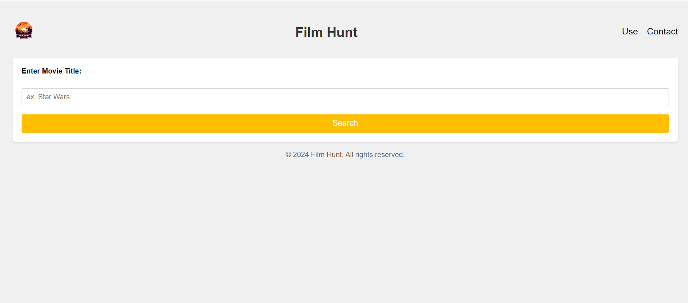
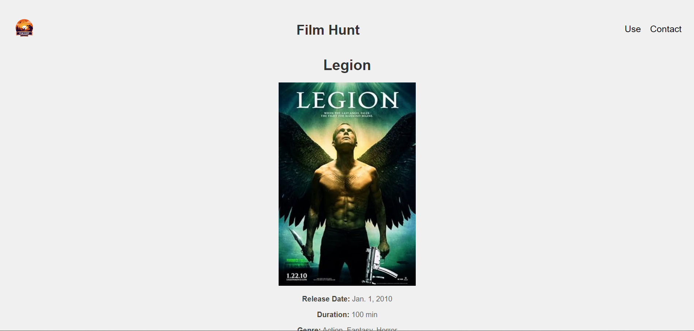
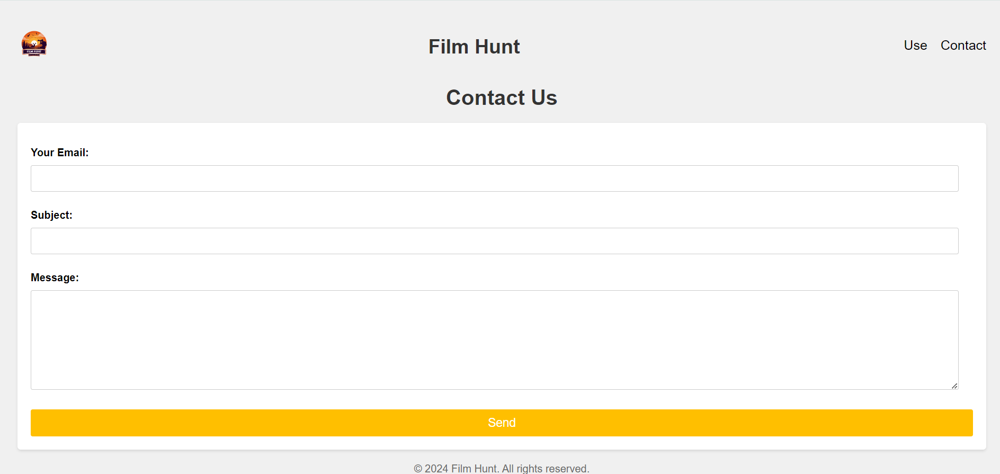
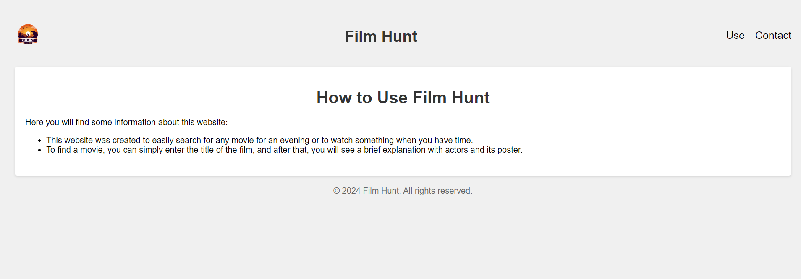

# Film Hunt - Movie Search App

    

Film Hunt is a web application built with Django, allowing users to search for movies using the OMDB API. Users can enter the title of a movie, and the application will retrieve information about that movie from the OMDB database, displaying details such as release date, duration, genre, director, actors, plot, and IMDb ID.

## Features

- Search for movies by title
- Retrieve detailed information about movies from the OMDB database
- Display movie details including release date, duration, genre, director, actors, plot, and IMDb ID
- Clean and intuitive user interface
- Possibility to send email with questions or propositions
- Page with little explication of usage for users

## Usage

1. Navigate to the homepage.
2. Enter the title of a movie in the search bar and submit the form.
3. View detailed information about the movie on the results page.
4. To return on home page you can click on button at the end or either on web-site name.
5. Navigate to contact page.
6. Possible to send an email

## Screenshots

*Home Page*

*Movie Detail*

*Contact Page*

*Usage Page*

## Technologies Used

- **Django**: A high-level Python web framework for rapid development and clean, pragmatic design [docs](https://docs.djangoproject.com/en/5.0/).
- **OMDB API**: A RESTful web service to obtain movie information, including plot, cast, genre, ratings, and more [docs](https://www.omdbapi.com/).
- **Flake8**: A tool for enforcing Python style conventions, helping maintain clean and readable code [docs](https://flake8.pycqa.org/en/latest/).
- **python-dotenv**: A Python library for managing environment variables, used for storing sensitive information like API keys [docs](https://pypi.org/project/python-dotenv/).
- **Faker**: A Python library for generating fake data, helpful for testing and development purposes [docs](https://pypi.org/project/Faker/).
- **Gunicorn**: A Python WSGI HTTP server for UNIX, used for serving Django applications in production [docs](https://docs.gunicorn.org/en/stable/).
- **Whitenoise**: A Django library for serving static files efficiently, improving application performance [docs](https://whitenoise.readthedocs.io/en/latest/).
- **django-cors-headers**: A Django library for handling Cross-Origin Resource Sharing (CORS) headers, enabling cross-origin requests [docs](https://pypi.org/project/django-cors-headers/).
- **Coverage**: A Python library for measuring code coverage, helping ensure thorough testing of the application [docs](https://coverage.readthedocs.io/en/7.5.1/).
- **Heroku**: Film Hunt utilizes Heroku for deploying the application, ensuring accessibility to users over the internet [docs](https://devcenter.heroku.com/categories/reference).
- **Codecov**: Codecov is integrated into the pipeline to provide insights into code coverage [docs](https://docs.codecov.com/docs/quick-start).
- **Docker**: Docker is a containerization platform that allows developers to package applications and their dependencies into standardized units called containers [docs](https://docs.docker.com/).

## Deployment

### Local Deployment

To deploy the application locally for development or testing purposes, follow these steps:

1. Clone the repository: `git clone git@github.com:Dokuqui/Find-Movie-APP_Django.git`
2. Install dependencies: `pip install -r requirements.txt`
3. Set up environment variables:
    - Obtain an API key from OMDB API and set it as `OMDB_API_KEY` in your environment variables.
4. Run migrations: `python manage.py migrate`
5. Start the development server: `python manage.py runserver`
6. Also if you want to use locally send email you will need to add also email app password as key(for example gmail): `GMAIL_PASSWORD`

### Docker Integration

Film Hunt incorporates Docker to facilitate deployment on Heroku and streamline the application's deployment process. Here's why Docker is used in this project:

1. **Portability**: Docker containers encapsulate the application along with its dependencies, ensuring consistency across different environments. This portability simplifies the deployment process and reduces the likelihood of compatibility issues.

2. **Isolation**: Docker containers provide a lightweight and isolated environment for running applications. Each container operates independently of the host system and other containers, minimizing conflicts and ensuring application stability.

3. **Ease of Deployment**: With Docker, the entire application, including its dependencies and configuration, is packaged into a single container. This container can be easily deployed to any environment that supports Docker, such as Heroku. This simplifies the deployment process and reduces the risk of configuration errors.

4. **Heroku Compatibility**: Heroku supports deploying Docker containers directly, making it an ideal platform for hosting Dockerized applications. By using Docker, Film Hunt can take advantage of Heroku's container deployment capabilities, enabling seamless deployment and scaling of the application.

### Heroku Deployment

Here's how Heroku is used in this project:

1. **Application Deployment**: Heroku hosts the Film Hunt application, allowing users to access it without managing server infrastructure. The deployment process is streamlined, requiring minimal configuration.

2. **Scalability**: Heroku offers seamless scalability, ensuring that the application can handle increased traffic or workload by dynamically adjusting resources. This ensures a consistent user experience, even during periods of high demand.

3. **Continuous Deployment**: Film Hunt leverages Heroku's GitHub integration for continuous deployment. Whenever changes are pushed to the `main` branch of the GitHub repository, Heroku automatically builds and deploys the updated application with use of Docker container building. This automation reduces manual intervention and ensures that the latest version of the application is always available to users.

4. **Database Hosting**: Heroku provides a managed PostgreSQL database for storing movie data and application information. This ensures that the application's data is securely stored and easily accessible. Heroku handles database backups, maintenance, and scaling, simplifying database management for developers.

By leveraging Heroku's platform, Film Hunt benefits from streamlined deployment, scalability, reliability, and ease of management, providing users with a seamless movie search experience.

## Pipeline Configuration

The project includes a pipeline configuration using GitHub Actions for continuous integration and deployment. The pipeline consists of the following jobs:

- **Build**: Used to build env for future use on linux.
- **Lint**: Checks the code for style violations using Flake8.
- **Test**: Runs tests with code coverage using Coverage.py.
- **Deploy**: Deploys the application on Heroku after passing linting and testing.

The pipeline is triggered on push and pull requests to the main branch and also won't be triggered if commit message will start with [`doc`].

## Codecov Integration

Codecov collects coverage reports generated during testing and displays them in a dashboard, helping identify areas of the codebase that need more testing.

*Codecov Dashboard*

## Credits

This project was created by Semenov Illia.
All rights reserved. @Dokuqui, &copy; 2024